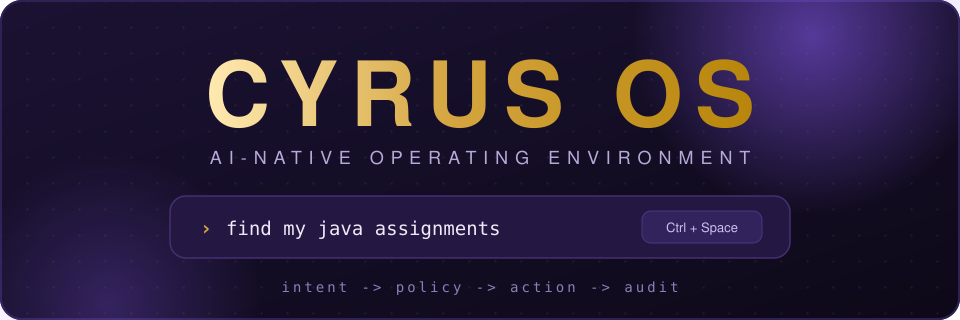
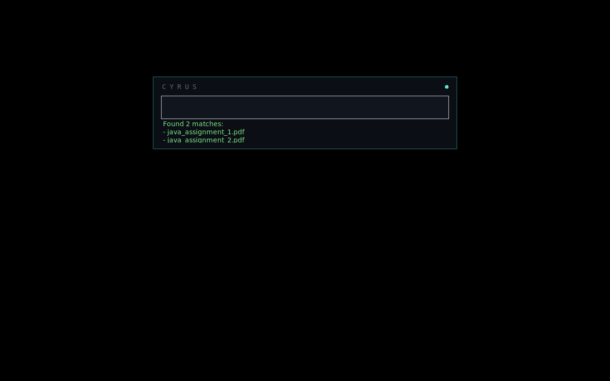
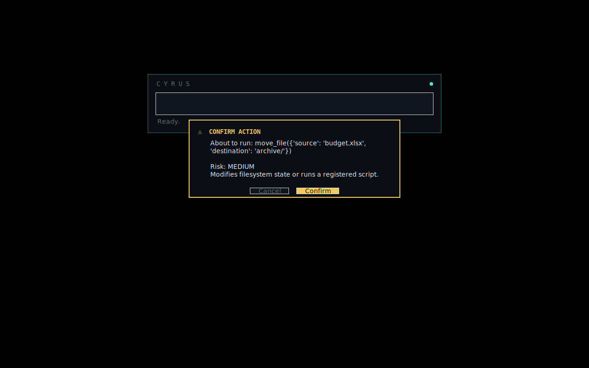
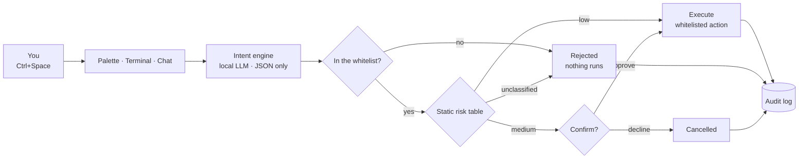

<div align="center">



<p><b>You speak in intent. CYRUS plans it, checks permission, does it, proves it.</b></p>

<p>
  
  
  
  
  
</p>

<p>
  <a href="#try-it-right-now"><b>Try it</b></a> ·
  <a href="#cyrus-studio"><b>Studio</b></a> ·
  <a href="#the-pipeline"><b>How it thinks</b></a> ·
  <a href="#the-safety-model"><b>Safety model</b></a> ·
  <a href="#repository-tour"><b>Repo tour</b></a>
</p>

</div>

---

## What CYRUS OS is

An **AI-native operating environment**: you say what you want in plain language, and CYRUS turns it
into a *plan*, runs it through a *permission gate*, executes only what is *whitelisted*, and writes
an *audit log* of every step. The desktop, the terminal, the chat and the palette are four windows
into the same brain — none of them contain their own intelligence.

> **One brain, two surfaces**
>
> | Surface | What it is | Where |
> |---|---|---|
> | 🖥️ **CYRUS OS (browser)** | Boot → lock screen → desktop → windows → dock → Start menu, with the full intent→policy→action pipeline ported to JS. One self-contained HTML file. | [`.freebuff/cyrus-os.html`](.freebuff/cyrus-os.html) |
> | 🐍 **CYRUS (native)** | Hotkey palette + local LLM + semantic file index acting on your **real** filesystem, behind a five-intent whitelist. | [`cyrus/`](cyrus/README.md) |

> [!NOTE]
> CYRUS started as "NOVA OS" — a spec for a kernel, an app format and compatibility layers, written
> before a single line of code. This is the opposite: **a palette, a brain, and a locked-down hand.**
> Smallest thing that can feel magical in a week.

<div align="center">

|  |  |
| :---: | :---: |
| *One request, end to end — ranked results in the palette* | *Anything that changes state asks first* |

</div>

## Try it right now

**The OS — no install, no build, no dependencies.** It is a single HTML file:

```bash
start .freebuff/cyrus-os.html        # Windows
open .freebuff/cyrus-os.html         # macOS
xdg-open .freebuff/cyrus-os.html     # Linux
```

Yes, it lives in a dot-folder. It is still just one file you can double-click.
State (virtual filesystem, audit log, settings) persists in `localStorage` under `cyrus_os_v2`;
**Settings → System → Reset CYRUS OS** reseeds the demo disk.

**The native layer — Python + a local model:**

```bash
cd cyrus
bash scripts/install.sh      # pip deps + pulls qwen2.5:3b (Ollama must be installed)
python -m cyrus.main         # then press Ctrl+Space
python -m pytest tests/      # 7 safety tests — whitelist + risk gate (pip install pytest)
```

Prefer a picture? Open [`.freebuff/cyrus-architecture.html`](.freebuff/cyrus-architecture.html) in a
browser for a visual map of the layers.

## The pipeline

Every request — from the palette, the terminal, the chat, or the CLI — takes the exact same road.
Nothing skips a step, and nothing retries with a "looser" interpretation.



If intent parsing fails, CYRUS stops and says so. It never guesses.

## ✨ What's inside

| | |
|---|---|
| **🖥️ Real desktop chrome** — boot sequence, lock screen, windows with Windows 11 caption buttons, macOS-style bubble dock, Start-menu home layout, pointer-interactive wallpaper. | **🤖 Command palette** — `Ctrl+Space` anywhere: type an intent, get a ranked action. Never a settings hunt. |
| **🧠 CYRUS Brain** — multi-AI router: keyless lanes first, local rules always catch the fall; paste your own key and it jumps every queue. | **🖥️ Terminal `cyrus-sh`** — ~110 commands (grep, chmod, netstat, package managers…), shell operators, `man`/`cheat`, a mini-git, a docker sim, plus `ask` / `explain` / `ai`. |
| **💬 Two AIs, split on purpose** — `CYRUS 💬` is the chatbot that answers anything; the **Command Assistant** is the executor that only ever emits whitelisted intents. | **🔍 Semantic search** — `all-MiniLM-L6-v2` embeddings over your paths in SQLite. Find things by meaning, not by filename. |
| **🪄 App Maker** — describe an app, CYRUS writes the single-file HTML, runs it sandboxed in an iframe, pins it to Start → My Apps. | **🧠 Memory** — say *"remember that …"* and the fact is saved to `~/Memory/cyrus-memory.json`, then re-injected into every conversation. |
| **🎬 CYRUS Video & Avatar** — storyboard → keyless image engine → narrated playback; a talking presenter (optional D-ID key). | **🎨 Generative themes** — *"a candlelit library at midnight"* → model returns a palette → wallpaper and accent recompose. |
| **🗣️ Voice loop** — mic dictation into any input, optional spoken replies. | **🌅 Daily briefing** — once a day, three lines written from live OS context (with an honest offline fallback). |
| **🗂️ Files, Notes & Studio** — persistent virtual FS, and [CYRUS Studio](#cyrus-studio): a real editor with multi-cursor, an explorer, a runner, and a Copilot that always shows a diff. | **📦 Smart Organizer** — `organize Downloads` → AI proposes the plan → you review → `--apply` → `--undo`. |
| **🔒 Policy gate + audit log** — every request, intent, risk level, confirmation and result is logged, success or failure. | **⚡ Motion with taste** — press ripples, spring easing, gold focus rings, staggered entrances — all switched off by **Settings → Animations off**. |

## CYRUS Studio

The dock's **CYRUS Studio** entry opens a Cursor/VS Code-class IDE that lives *inside* the same HTML
file — same brain, same permission model, same audit log. Open it from the dock, the Start menu, or
`openStudio({ path })`.

**What is genuinely implemented**

| Area | What actually works |
|---|---|
| **Editor** | Multi-cursor, undo/redo, folding, bracket matching, auto-close, smart indent, find/replace with regex, minimap, and a transparent-textarea overlay so the caret never fights the highlighter. |
| **Languages** | One tokenizer drives highlighting, symbols, folding and diagnostics for **98 languages / 222 extensions** — no per-language plugin, no compiler. |
| **Explorer** | Create, rename, duplicate, copy/cut/paste, drag-to-move, multi-select, inline rename, filter. Every mutation goes through the policy gate and the audit log. |
| **Navigation** | `Ctrl+P` quick open, `Ctrl+Shift+O` goto symbol, workspace symbols, find-references, `Ctrl+G` goto line, breadcrumb, outline. **72 commands** behind `Ctrl+Shift+P`. |
| **Runner** | JavaScript **really executes** (with a 3s watchdog); TypeScript type annotations are stripped and the JS subset runs; JSON validates; HTML, CSS, Markdown and SVG render. Python runs in a line-level sandbox. |
| **Diagnostics** | Bracket balance *from the token stream*, unterminated strings, unused imports, include guards, bare `except`, loose equality, hard-coded secrets — all flagged with the exact line. |
| **Quick Fix** | Eleven **mechanical** fixers CYRUS derives from the token stream itself — missing closers, unterminated strings, unused imports, `var`→`let`, `==`→`===`, bare `except`, include guards, mixed indentation. No model is consulted, and the diff says so. Everything else is offered as a labelled AI proposal. |
| **Debug** | No breakpoints and no stepper — a page cannot host a debugger. Instead: a live token inspector that follows your caret, the real token stream, and the real timing of the last run. |
| **CYRUS Copilot** | Chat with real workspace context (open files, symbols, diagnostics, learned style), inline ghost-text completion, and agentic edits that **always** arrive as a diff you accept or reject. |
| **Extensions** | Eight first-party extensions as **declarative JSON manifests**, gated by a 7-capability permission table. A plugin structurally cannot run arbitrary code. |
| **Project** | `cyrus.project.json` — auto-detected, editable, and used for run configs and AI context. |
| **Connections** | A **permanent** sidebar panel plus a status-bar cell showing the real state of every provider. Sign in to Puter once and CYRUS keeps the authority — see below. |
| **Surfaces** | 5 themes, full settings, terminal, output/debug/problems panels, and an honesty page. |

### Connections — sign in once

The **Connections** section is pinned under the Explorer tree and is never collapsed, so the
state of every provider is visible for the whole life of the window. The status bar carries a
matching cell (`🔑 3/7 live`); click it or run `Connections: Manage Providers…`.

Puter is the reason this exists. Its SDK **deliberately discards its own stored session on web
pages** — `discardStoredSessionToken_()` runs on every web boot — so its popup asks for a
sign-in over and over. But `setAuthToken()` is public and `puter.authToken` is readable after
any sign-in. So CYRUS captures the authority the moment a sign-in completes, stores it beside
the provider keys it already keeps, and re-applies it on every boot. **You are asked once.**

CYRUS looks for a live authority in four places, in order: `puter.authToken`, the token behind
`puterAuthState.authGranted`, `localStorage["puter.auth.token.v2"]`, and
`localStorage["puter.auth.token"]`. Whatever it finds must survive `normalize()` — anything
that looks like `"undefined"`, `"[object Object]"`, a boolean, or a short string is rejected
rather than stored, because a broken capture would otherwise silently poison every later boot.

**The panel never rounds a guess up into a claim.** A provider turns green only when something
actually proved it — for Puter that means `whoami()` resolved, not merely that a token exists.
A 401 shows amber and offers one click; a failing probe shows red. Pollinations is keyless but
currently 403s behind Turnstile, so it shows **red**, not a free win. If the SDK exposes no
`whoami` surface, the row is flagged `weak` and reads *authority saved (unverified)* rather
than pretending it was confirmed.

The token itself is never rendered — the sheet shows `••••••••` plus the last four digits — and
never reaches the audit log. **Forget** removes it; the next use asks you to sign in again.
Honest limits: Puter may revoke or rotate a saved token, and if the popup is blocked by the
embedder no authority is captured at all — in which case CYRUS says so and points at
Settings → CYRUS Brain, where a token can still be pasted by hand.

**Keyboard**

```text
Ctrl+P          quick open          Ctrl+Shift+O   goto symbol
Ctrl+Shift+P    command palette     Ctrl+Shift+F   find references
Ctrl+G          goto line           Ctrl+B         toggle explorer
Ctrl+S          save                Ctrl+F / H     find / replace
Ctrl+.          quick fix at the cursor
Tab             accept inline suggestion (CYRUS never writes without you)
Esc             dismiss palette
```

### Quick Fix: two tiers, and the difference matters

`if(x > 1 {` is missing a `)`. CYRUS already computed the bracket stack that proves it — sending
that to a model would turn a certainty into a coin flip. So fixes are split by how much CYRUS can
actually know, and the diff badge always says which tier produced it.

| Tier | Who computes it | What it covers |
|---|---|---|
| ⚡ **mechanical** | CYRUS, from the token stream. No model. | missing closers · unterminated strings · unused imports · `var`→`let` · `==`→`===` · bare `except` · missing include guards · mixed indentation |
| ✷ **AI proposal** | A model. A guess. | logic bugs · hard-coded secrets · anything where the right answer is ambiguous |

Two rules the implementation holds to:

- **A mismatch is never auto-fixed.** `const b = [1,2;` makes the `}` swallow the `[`, and the
  leftover `{` then looks unclosed. Appending a `}` would "fix" a file that was actually missing a
  `]`. So once the bracket stack desyncs, CYRUS reports the mismatch and *refuses* to guess.
- **Fix All only batches safe fixes.** Adding `export` to silence an "unused" warning is mechanical
  and correct, but it changes a module's public surface, so it stays a one-at-a-time decision.

Entry points: a ⚡ button on every mechanically-fixable problem, ⚡ **Fix all N** in the Problems
header, right-click for both tiers, and `Ctrl+.` for whatever is under the cursor. Everything lands
as one diff; nothing is written until you accept; every application is audit-logged with its tier.

**What it refuses to pretend**

- **No type checker.** Diagnostics are structural, not semantic. They will miss real bugs.
- **No real shell.** For Rust, Go, Java or a package manager, Studio prints the host command
  (`cargo run`, `go run …`) and refuses to fabricate its output.
- **No debugger.** No breakpoints, no stepper — those need a language server as a real process.
  The Debug panel gives you the token stream and the caret's token instead, and says what it can't do.
- **No third-party code.** Extensions are manifests. A plugin that could call anything would
  undermine the one promise this OS makes.

Open **Settings → What CYRUS Studio really does** inside the app for the same list, in-product.

## Things to try

```text
Ctrl+Space →  find my java assignments          → ranked search, Files opens with results
Ctrl+Space →  start my college workspace        → restores Files + Editor + Notes
Ctrl+Space →  move project.zip to Downloads     → 🟡 MEDIUM risk → confirmation dialog
Ctrl+Space →  delete everything in C:\          → 🔴 CRITICAL → blocked outright, no dialog
Ctrl+Space →  create a python project for…      → scaffolds a project tree
Terminal   →  ask compress the Projects folder  → the exact command is staged for your approval
Terminal   →  organize Downloads --apply        → review the plan, then commit it
Chat       →  remember that my sister's birthday is March 3
```

## The safety model

The model never gets a terminal. **[`cyrus/cyrus/actions.py`](cyrus/cyrus/actions.py) is the
security boundary** — it only validates and dispatches; a generic `shell(cmd)` helper is banned by
design, because that collapses the whitelist back into "AI has a terminal".

| Intent | Example | Risk | Gate |
|---|---|---|---|
| `search_files` | "find my java assignments" | 🟢 low | runs |
| `open_app` | "open vs code" | 🟢 low | runs |
| `open_workspace` | "start my college workspace" | 🟢 low | runs |
| `move_file` | "move report.pdf to Documents/Work" | 🟡 medium | **confirm** |
| `run_script` | "set up my python data science environment" | 🟡 medium | **confirm**, pre-registered scripts only |

Five intents, on purpose. Adding a sixth is the wrong next step until these five feel reliable.

- **Schema-validated output.** The LLM returns one JSON object; anything outside `INTENT_SCHEMAS` is
  rejected *before* dispatch — hallucinated action names never run.
- **A sandbox on disk.** Moves are refused outside `indexed_paths`; scripts must be registered in
  `config.yaml`; unregistered apps don't launch.
- **A risk table you can read in 30 seconds.** Static, not learned — and anything unclassified is
  treated as 🔴 **high** and can never be auto-confirmed.
- **Everything is logged.** `cyrus_log.sqlite3` on the native side, the Memory app in the OS.
- **Local by default.** Ollama runs the intent parser offline. Cloud is a single `if` branch,
  opt-in via `CYRUS_CLOUD_KEY` — never required.

> If it's not in `config.yaml`, CYRUS cannot act on it. That's the point.

## Repository tour

```text
CYRUS OS/
├── .freebuff/
│   ├── cyrus-os.html            ← the OS: boot to desktop, one file, no build
│   ├── rebuild.js               ← deterministic Studio build (restores from HEAD, strips any prior studio block, splices chunks, syntax-checks)
│   ├── validate_regex.js        ← compiles all 85 symbol regexes; a bad one fails the build, not the page
│   ├── test_fixes.js            ← 90 assertions over the Quick Fix fixers, diagnostics and symbol families
│   ├── test_conn.js             ← 53 assertions over provider authority: capture, verify, forget, audit secrecy
│   ├── studio_p*.js             ← Studio source chunks, one per phase
│   └── cyrus-architecture.html  ← visual map of the layers
├── cyrus/                       ← the native Python command layer
│   ├── cyrus/
│   │   ├── main.py              ← hotkey → palette → intent → permissions → dispatch → log
│   │   ├── intent.py            ← LLM → validated JSON (local first, cloud opt-in)
│   │   ├── actions.py           ← the whitelist = the security boundary
│   │   ├── permissions.py       ← static risk table (read it in 30 seconds)
│   │   ├── indexer.py           ← sentence-transformers + SQLite semantic index
│   │   ├── memory.py            ← append-only audit log
│   │   └── palette_ui.py        ← Tkinter palette (ships with Python)
│   ├── config.yaml              ← everything the AI may touch, declared
│   ├── scripts/                 ← install.sh + the registered, pre-approved scripts
│   └── tests/                   ← 7 tests aimed only at the safety-critical files
├── assets/                      ← screenshots + banner
├── cyrus.zip / files.zip        ← release snapshots
└── README.md                    ← you are here
```

## Extending it

Adding a sixth action takes four edits, and each one is a place a reviewer can say no:

1. Declare it in `INTENT_SCHEMAS` (`cyrus/cyrus/actions.py`) with its fields and risk level.
2. Name it in `SYSTEM_PROMPT` (`cyrus/cyrus/intent.py`) so the model is allowed to emit it.
3. Write the handler and wire it into `dispatch()` — no generic shell calls.
4. Add a test in `cyrus/tests/` that proves the unregistered path is still rejected.

## Honest limits right now

- **Not a kernel.** The browser OS runs on a virtual filesystem in `localStorage`; the native layer
  acts on your real disk, but only inside `indexed_paths`.
- **Studio has no language servers.** Real type checking and compiler-driven refactors need
  tsserver, pyright and rust-analyzer as separate processes. A single page cannot host them, so
  Studio does structural analysis and says so.
- **Search is over filenames and paths**, not full file contents — content indexing has real cost
  and staleness implications, so it is a deliberate v2 decision, not a missing checkbox.
- **Keyless AI lanes are community services.** They rate-limit and they go down; paste your own key
  in Settings or run Ollama for a fully offline brain.
- **The risk table is static.** Correct for v1: a table you can read beats a black box with
  filesystem access.

---

<div align="center">
  <br>
  <b>Palette · brain · locked-down hand.</b><br>
  <sub>No accounts, no telemetry, no required API key. Files, settings and audit history stay on your machine.</sub>
</div>
