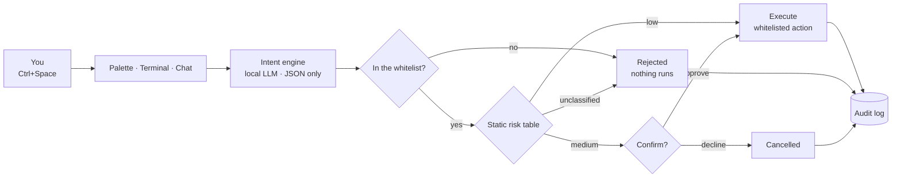

<div align="center">


<p><b>You speak in intent. CYRUS plans it, checks permission, does it, proves it.</b></p>

<p>
  
  
  
  
  
</p>

<p>
  <a href="#try-it-right-now"><b>Try it</b></a> ·
  <a href="#the-pipeline"><b>How it thinks</b></a> ·
  <a href="#the-safety-model"><b>Safety model</b></a> ·
  <a href="#repository-tour"><b>Repo tour</b></a>
</p>

</div>

---

## What CYRUS OS is

An **AI-native operating environment**: you say what you want in plain language, and CYRUS turns it
into a *plan*, runs it through a *permission gate*, executes only what is *whitelisted*, and writes
an *audit log* of every step. The desktop, the terminal, the chat and the palette are four windows
into the same brain — none of them contain their own intelligence.

> **One brain, two surfaces**
>
> | Surface | What it is | Where |
> |---|---|---|
> | 🖥️ **CYRUS OS (browser)** | Boot → lock screen → desktop → windows → dock → Start menu, with the full intent→policy→action pipeline ported to JS. One self-contained HTML file. | [`.freebuff/cyrus-os.html`](.freebuff/cyrus-os.html) |
> | 🐍 **CYRUS (native)** | Hotkey palette + local LLM + semantic file index acting on your **real** filesystem, behind a five-intent whitelist. | [`cyrus/`](cyrus/README.md) |

> [!NOTE]
> CYRUS started as "NOVA OS" — a spec for a kernel, an app format and compatibility layers, written
> before a single line of code. This is the opposite: **a palette, a brain, and a locked-down hand.**
> Smallest thing that can feel magical in a week.

<div align="center">

|  |  |
| :---: | :---: |
| *One request, end to end — ranked results in the palette* | *Anything that changes state asks first* |

</div>

## Try it right now

**The OS — no install, no build, no dependencies.** It is a single HTML file:

```bash
start .freebuff/cyrus-os.html        # Windows
open .freebuff/cyrus-os.html         # macOS
xdg-open .freebuff/cyrus-os.html     # Linux
```

Yes, it lives in a dot-folder. It is still just one file you can double-click.
State (virtual filesystem, audit log, settings) persists in `localStorage` under `cyrus_os_v2`;
**Settings → System → Reset CYRUS OS** reseeds the demo disk.

**The native layer — Python + a local model:**

```bash
cd cyrus
bash scripts/install.sh      # pip deps + pulls qwen2.5:3b (Ollama must be installed)
python -m cyrus.main         # then press Ctrl+Space
python -m pytest tests/      # 7 safety tests — whitelist + risk gate (pip install pytest)
```

Prefer a picture? Open [`.freebuff/cyrus-architecture.html`](.freebuff/cyrus-architecture.html) in a
browser for a visual map of the layers.

## The pipeline

Every request — from the palette, the terminal, the chat, or the CLI — takes the exact same road.
Nothing skips a step, and nothing retries with a "looser" interpretation.



If intent parsing fails, CYRUS stops and says so. It never guesses.

## ✨ What's inside

| | |
|---|---|
| **🖥️ Real desktop chrome** — boot sequence, lock screen, windows with Windows 11 caption buttons, macOS-style bubble dock, Start-menu home layout, pointer-interactive wallpaper. | **🤖 Command palette** — `Ctrl+Space` anywhere: type an intent, get a ranked action. Never a settings hunt. |
| **🧠 CYRUS Brain** — multi-AI router: keyless lanes first, local rules always catch the fall; paste your own key and it jumps every queue. | **🖥️ Terminal `cyrus-sh`** — ~110 commands (grep, chmod, netstat, package managers…), shell operators, `man`/`cheat`, a mini-git, a docker sim, plus `ask` / `explain` / `ai`. |
| **💬 Two AIs, split on purpose** — `CYRUS 💬` is the chatbot that answers anything; the **Command Assistant** is the executor that only ever emits whitelisted intents. | **🔍 Semantic search** — `all-MiniLM-L6-v2` embeddings over your paths in SQLite. Find things by meaning, not by filename. |
| **🪄 App Maker** — describe an app, CYRUS writes the single-file HTML, runs it sandboxed in an iframe, pins it to Start → My Apps. | **🧠 Memory** — say *"remember that …"* and the fact is saved to `~/Memory/cyrus-memory.json`, then re-injected into every conversation. |
| **🎬 CYRUS Video & Avatar** — storyboard → keyless image engine → narrated playback; a talking presenter (optional D-ID key). | **🎨 Generative themes** — *"a candlelit library at midnight"* → model returns a palette → wallpaper and accent recompose. |
| **🗣️ Voice loop** — mic dictation into any input, optional spoken replies. | **🌅 Daily briefing** — once a day, three lines written from live OS context (with an honest offline fallback). |
| **🗂️ Files, Studio & Notes** — persistent virtual FS; a VS Code-style editor with a Copilot panel (explain / find bugs / comment / tests / optimize) that runs JS, Python and live HTML. | **📦 Smart Organizer** — `organize Downloads` → AI proposes the plan → you review → `--apply` → `--undo`. |
| **🔒 Policy gate + audit log** — every request, intent, risk level, confirmation and result is logged, success or failure. | **⚡ Motion with taste** — press ripples, spring easing, gold focus rings, staggered entrances — all switched off by **Settings → Animations off**. |

## Things to try

```text
Ctrl+Space →  find my java assignments          → ranked search, Files opens with results
Ctrl+Space →  start my college workspace        → restores Files + Editor + Notes
Ctrl+Space →  move project.zip to Downloads     → 🟡 MEDIUM risk → confirmation dialog
Ctrl+Space →  delete everything in C:\          → 🔴 CRITICAL → blocked outright, no dialog
Ctrl+Space →  create a python project for…      → scaffolds a project tree
Terminal   →  ask compress the Projects folder  → the exact command is staged for your approval
Terminal   →  organize Downloads --apply        → review the plan, then commit it
Chat       →  remember that my sister's birthday is March 3
```

## The safety model

The model never gets a terminal. **[`cyrus/cyrus/actions.py`](cyrus/cyrus/actions.py) is the
security boundary** — it only validates and dispatches; a generic `shell(cmd)` helper is banned by
design, because that collapses the whitelist back into "AI has a terminal".

| Intent | Example | Risk | Gate |
|---|---|---|---|
| `search_files` | "find my java assignments" | 🟢 low | runs |
| `open_app` | "open vs code" | 🟢 low | runs |
| `open_workspace` | "start my college workspace" | 🟢 low | runs |
| `move_file` | "move report.pdf to Documents/Work" | 🟡 medium | **confirm** |
| `run_script` | "set up my python data science environment" | 🟡 medium | **confirm**, pre-registered scripts only |

Five intents, on purpose. Adding a sixth is the wrong next step until these five feel reliable.

- **Schema-validated output.** The LLM returns one JSON object; anything outside `INTENT_SCHEMAS` is
  rejected *before* dispatch — hallucinated action names never run.
- **A sandbox on disk.** Moves are refused outside `indexed_paths`; scripts must be registered in
  `config.yaml`; unregistered apps don't launch.
- **A risk table you can read in 30 seconds.** Static, not learned — and anything unclassified is
  treated as 🔴 **high** and can never be auto-confirmed.
- **Everything is logged.** `cyrus_log.sqlite3` on the native side, the Memory app in the OS.
- **Local by default.** Ollama runs the intent parser offline. Cloud is a single `if` branch,
  opt-in via `CYRUS_CLOUD_KEY` — never required.

> If it's not in `config.yaml`, CYRUS cannot act on it. That's the point.

## Repository tour

```text
CYRUS OS/
├── .freebuff/
│   ├── cyrus-os.html            ← the OS: boot to desktop, one file, no build
│   └── cyrus-architecture.html  ← visual map of the layers
├── cyrus/                       ← the native Python command layer
│   ├── cyrus/
│   │   ├── main.py              ← hotkey → palette → intent → permissions → dispatch → log
│   │   ├── intent.py            ← LLM → validated JSON (local first, cloud opt-in)
│   │   ├── actions.py           ← the whitelist = the security boundary
│   │   ├── permissions.py       ← static risk table (read it in 30 seconds)
│   │   ├── indexer.py           ← sentence-transformers + SQLite semantic index
│   │   ├── memory.py            ← append-only audit log
│   │   └── palette_ui.py        ← Tkinter palette (ships with Python)
│   ├── config.yaml              ← everything the AI may touch, declared
│   ├── scripts/                 ← install.sh + the registered, pre-approved scripts
│   └── tests/                   ← 7 tests aimed only at the safety-critical files
├── assets/                      ← screenshots + banner
├── cyrus.zip / files.zip        ← release snapshots
└── README.md                    ← you are here
```

## Extending it

Adding a sixth action takes four edits, and each one is a place a reviewer can say no:

1. Declare it in `INTENT_SCHEMAS` (`cyrus/cyrus/actions.py`) with its fields and risk level.
2. Name it in `SYSTEM_PROMPT` (`cyrus/cyrus/intent.py`) so the model is allowed to emit it.
3. Write the handler and wire it into `dispatch()` — no generic shell calls.
4. Add a test in `cyrus/tests/` that proves the unregistered path is still rejected.

## Honest limits right now

- **Not a kernel.** The browser OS runs on a virtual filesystem in `localStorage`; the native layer
  acts on your real disk, but only inside `indexed_paths`.
- **Search is over filenames and paths**, not full file contents — content indexing has real cost
  and staleness implications, so it is a deliberate v2 decision, not a missing checkbox.
- **Keyless AI lanes are community services.** They rate-limit and they go down; paste your own key
  in Settings or run Ollama for a fully offline brain.
- **The risk table is static.** Correct for v1: a table you can read beats a black box with
  filesystem access.

---

<div align="center">
  <br>
  <b>Palette · brain · locked-down hand.</b><br>
  <sub>No accounts, no telemetry, no required API key. Files, settings and audit history stay on your machine.</sub>
</div>
